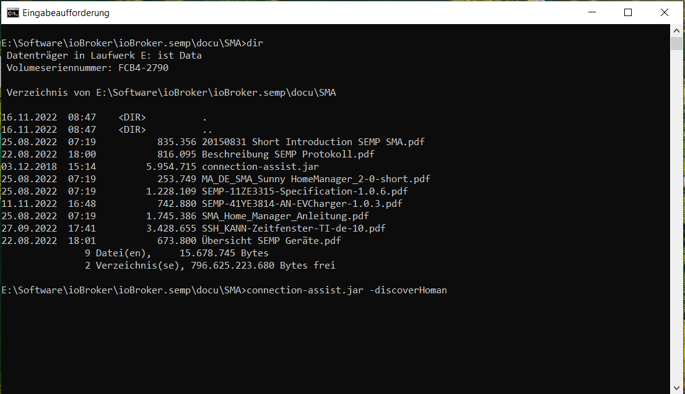
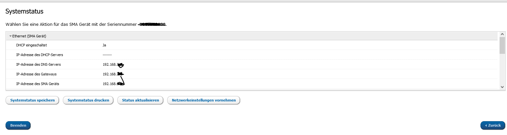
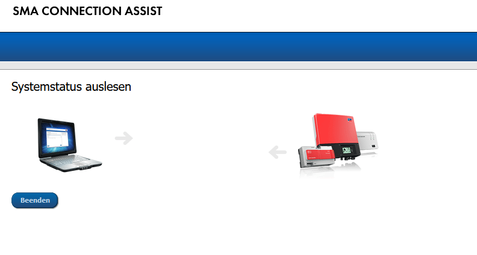

# Connection Assist

## Einleitung

Mit dem Connection Assist von SHM kann man die log files vom HomeMamager (und anderen SMA - Geräten) downloaden.
Für die Fehlersuche können diese log files hilfreich sein


## Herunterladen der log Files

* Sicherstellen, dass JAVA auf dem Rechner installiert ist
* Kopieren des "SMA Connection Assist" von  [connection-assist.jar](https://github.com/rg-engineering/ioBroker.semp/tree/master/docu/SMA/connection-assist.jar) auf den Windows-PC und irgendwohin speichern
* dann eine Eingabeaufforderung öffnen, in das Verzeichnis wechseln, wo die jar-Datei gespeichert wurde und 

```
connection-assist.jar -discoverHoman
```

aufrufen.

* das öffnet ein Browser-Fenster
* die SMA Geräte werden gesucht

* den SHM auswählen und verbinden
* als Passwort den RID eingeben (SHM2)

* Systemstatus speichern


* als smasl Datei speichern und nach zip umbenenennen (Achtung! Pfad merken, wohin gespeichert wurde)

* SEMPLog.tgz entpacken
* es sind 5 logs der letzten 5 Stunden enthalten
