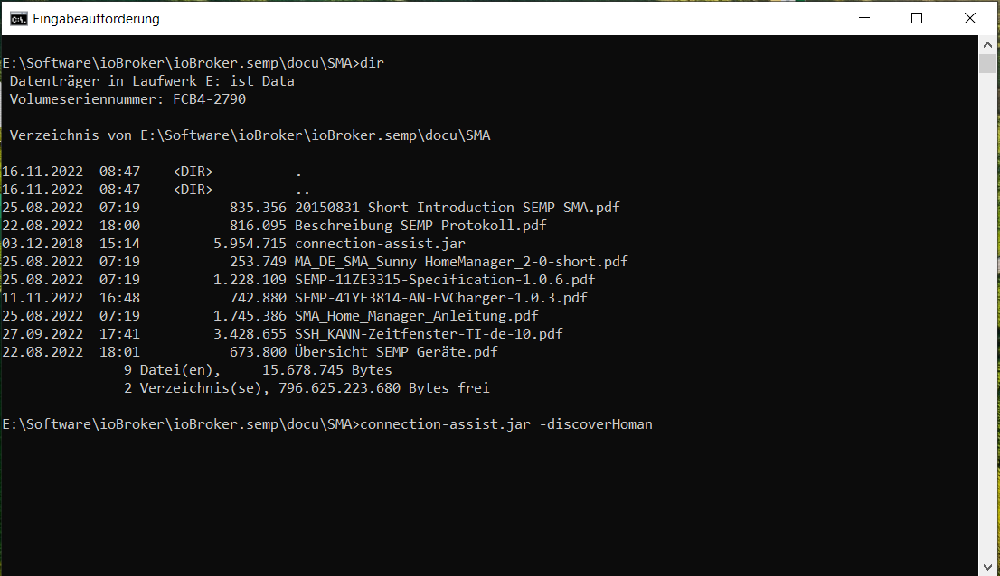
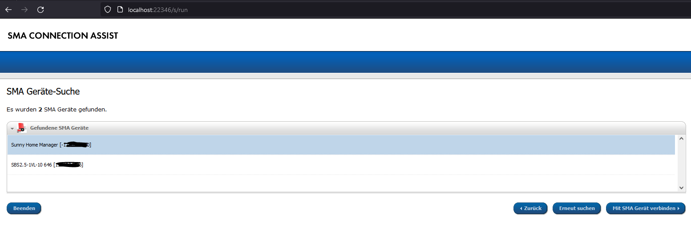
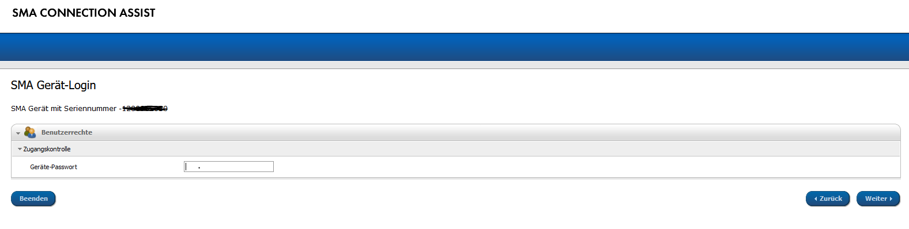
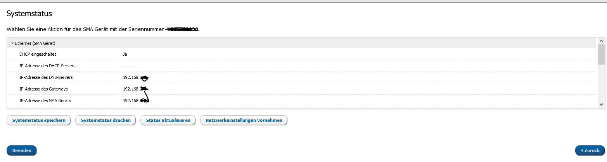
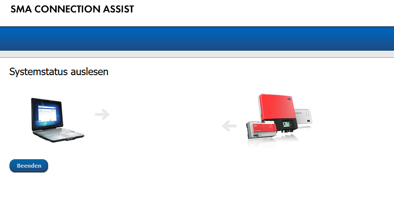
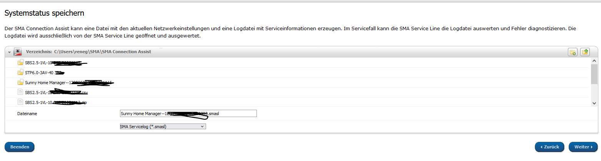

# Connection Assist

## Einleitung

Mit dem Connection Assist von SHM kann man die log files vom HomeMamager (und anderen SMA - Geräten) downloaden.
Für die Fehlersuche können diese log files hilfreich sein


## Herunterladen der log Files

* Sicherstellen, dass JAVA auf dem Rechner installiert ist
* Kopieren des "SMA Connection Assist" von  [connection-assist.jar](https://github.com/rg-engineering/ioBroker.semp/tree/master/docu/SMA/connection-assist.jar) auf den Windows-PC und irgendwohin speichern
* dann eine Eingabeaufforderung öffnen, in das Verzeichnis wechseln, wo die jar-Datei gespeichert wurde und 

```
connection-assist.jar -discoverHoman
```

aufrufen.

* das öffnet ein Browser-Fenster
* die SMA Geräte werden gesucht

* den SHM auswählen und verbinden
* als Passwort den RID eingeben (SHM2)

* Systemstatus speichern


* als smasl Datei speichern und nach zip umbenenennen (Achtung! Pfad merken, wohin gespeichert wurde)

* SEMPLog.tgz entpacken
* es sind 5 logs der letzten 5 Stunden enthalten


# SMA connection_assist findet keine Geräte – Fehlersuche-Anleitung

Wenn `connection_assist` im lokalen Netz keine oder nur einzelne SMA-Geräte (Wechselrichter, Sunny Home Manager) findet, obwohl der PC per Kabel am selben Switch hängt, hilft folgende systematische Vorgehensweise. Sie basiert auf einem real gelösten Fall mit zwei Ursachen gleichzeitig.

## Voraussetzung: Wireshark-Mitschnitt anlegen

1. [Wireshark](https://www.wireshark.org/) installieren, falls nicht vorhanden.
2. Mitschnitt auf dem Ethernet-Adapter starten, der zum Switch führt.
3. Filter setzen: `udp.port==9522`
4. In `connection_assist` einen Scan starten.
5. Mitschnitt stoppen und Pakete auswerten.

Das zeigt sofort, ob überhaupt Anfragen rausgehen und ob Geräte antworten – unabhängig davon, ob die Antworten am Ende bei der App ankommen.

---

## Schritt 1: Zieladresse der Discovery-Anfragen prüfen

SMA Speedwire-Discovery muss eigentlich an die feste Multicast-Adresse **239.12.255.254**, Port 9522, gesendet werden. Prüfe im Mitschnitt die ausgehenden Pakete deines PCs.

**Auffälligkeit, auf die man achten sollte:** Wenn die Zieladresse stattdessen z. B. `239.12.255.255` oder `239.0.255.255` lautet (letzte Oktette auf `.255.255`), berechnet das Tool die Adresse offenbar fehlerhaft anhand der Netzwerk-Adapterkonfiguration, statt die feste Adresse zu verwenden.

**Ursache:** Mehrere aktive Netzwerkadapter auf dem PC (VPN, VirtualBox/VMware Host-Only-Adapter, Hyper-V, Docker, etc.) verwirren die Adressberechnung des Tools.

**Lösung:**
1. `ipconfig /all` in der Kommandozeile ausführen.
2. Alle Adapter identifizieren, die **nicht** der physische Adapter zum Switch sind (typisch: VirtualBox Host-Only mit `192.168.56.x`, VMware, VPN-Adapter).
3. Diese Adapter über `ncpa.cpl` (Netzwerkverbindungen) **deaktivieren**.
4. `connection_assist` komplett beenden und neu starten (nicht nur den Scan wiederholen).
5. Erneut scannen und mit Wireshark prüfen.

→ In unserem Fall hat dieser Schritt dazu geführt, dass ein zusätzliches Gerät gefunden wurde, weil die Discovery-Anfrage jetzt nur noch über den korrekten Adapter lief.

---

## Schritt 2: Windows Firewall für UDP 9522 freigeben

Auch wenn Wireshark zeigt, dass Geräte korrekt antworten (z. B. per Multicast an `239.12.255.253`, per Broadcast an `255.255.255.255` oder direkt per Unicast an die eigene PC-IP), kann es sein, dass diese Antworten von Windows blockiert werden, **bevor** sie die Anwendung erreichen. Wireshark sieht die Pakete auf Treiberebene – das heißt nicht automatisch, dass `connection_assist` sie auch bekommt.

**Erkennungsmerkmal:** Im Mitschnitt sind SMA-Antwortpakete sichtbar (Payload beginnt mit `SMA`), aber das jeweilige Gerät taucht trotzdem nicht in `connection_assist` auf.

**Lösung – Firewall-Ausnahme einrichten:**

*Über die GUI:*
1. `wf.msc` öffnen ("Windows Defender Firewall mit erweiterter Sicherheit").
2. **Eingehende Regeln** → **Neue Regel...**
3. Regeltyp: **Port** → Weiter.
4. Protokoll **UDP**, bestimmte lokale Ports: `9522` → Weiter.
5. Aktion: **Verbindung zulassen** → Weiter.
6. Profil: alle drei Häkchen (Domäne, Privat, Öffentlich) lassen → Weiter.
7. Name vergeben, z. B. „SMA Speedwire UDP 9522 IN" → Fertigstellen.

*Per PowerShell (als Administrator), geht schneller:*
```powershell
New-NetFirewallRule -DisplayName "SMA Speedwire UDP 9522 IN" `
  -Direction Inbound -Protocol UDP -LocalPort 9522 -Action Allow -Profile Any

New-NetFirewallRule -DisplayName "SMA Speedwire UDP 9522 OUT" `
  -Direction Outbound -Protocol UDP -LocalPort 9522 -Action Allow -Profile Any
```

**Falls das nicht reicht, zusätzlich prüfen:**
- Netzwerkprofil des Adapters auf **„Privat"** stellen (Einstellungen → Netzwerk & Internet → Adapter → Netzwerkprofil), falls er als „Öffentlich" eingestuft ist.
- Eine zusätzliche **Programm-Regel** für `connection_assist.exe` anlegen (Regeltyp „Programm" statt „Port").
- Drittanbieter-Antivirus/-Firewall (Kaspersky, Norton, Bitdefender etc.) separat prüfen – diese filtern oft zusätzlich zur Windows-Firewall.

→ In unserem Fall hat genau dieser Schritt das letzte fehlende Gerät (den SHM2) sichtbar gemacht.

---

## Zusammenfassung des Ablaufs

| Schritt | Prüfung | Typisches Symptom | Lösung |
|---|---|---|---|
| 1 | Zieladresse der eigenen Anfragen | Ziel ist `x.x.255.255` statt `239.12.255.254` | Zusätzliche Netzwerkadapter (VPN, VirtualBox etc.) deaktivieren |
| 2 | Antworten der Geräte im Mitschnitt | SMA-Pakete sichtbar, Gerät erscheint trotzdem nicht im Tool | Firewall-Ausnahme für UDP 9522 (ein-/ausgehend) einrichten |

**Kurz-Checkliste für den eigenen Fall:**
- [ ] Wireshark-Mitschnitt mit Filter `udp.port==9522` angelegt
- [ ] `ipconfig /all` geprüft, unnötige Adapter deaktiviert
- [ ] `connection_assist` neu gestartet nach Adapter-Änderung
- [ ] Firewall-Regel für UDP 9522 (ein- und ausgehend) angelegt
- [ ] Netzwerkprofil des Adapters auf „Privat" gestellt
- [ ] Ggf. Drittanbieter-Sicherheitssoftware geprüft
- [ ] Erneuter Scan durchgeführt und mit Wireshark verifiziert