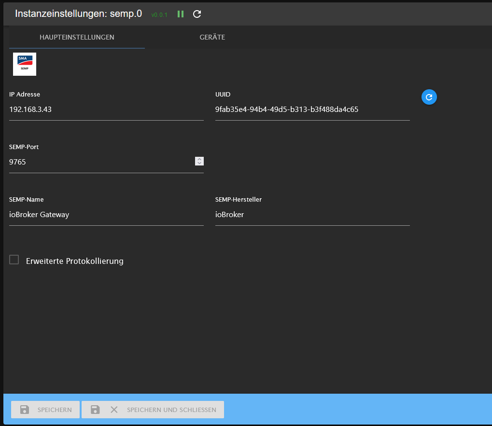
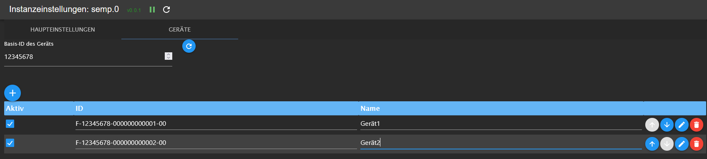
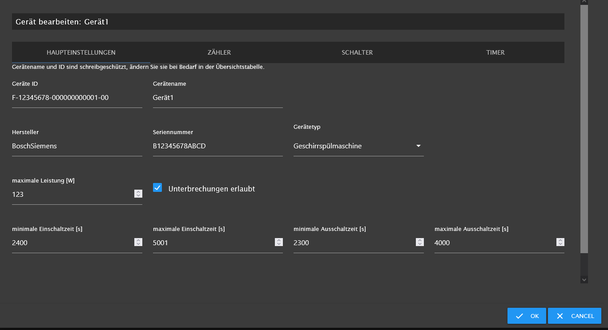
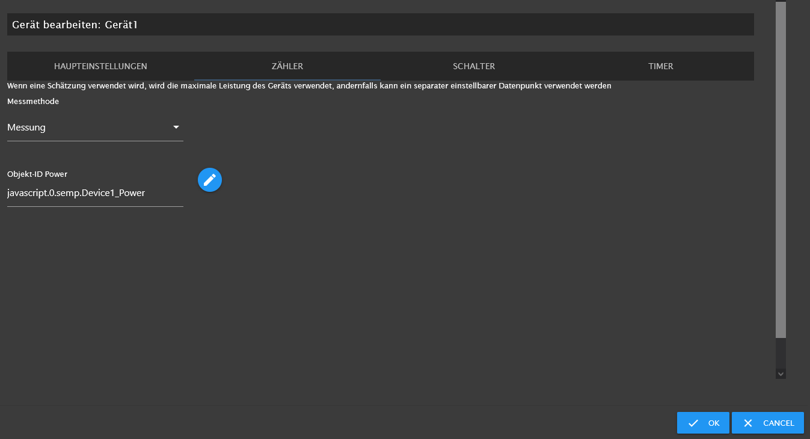
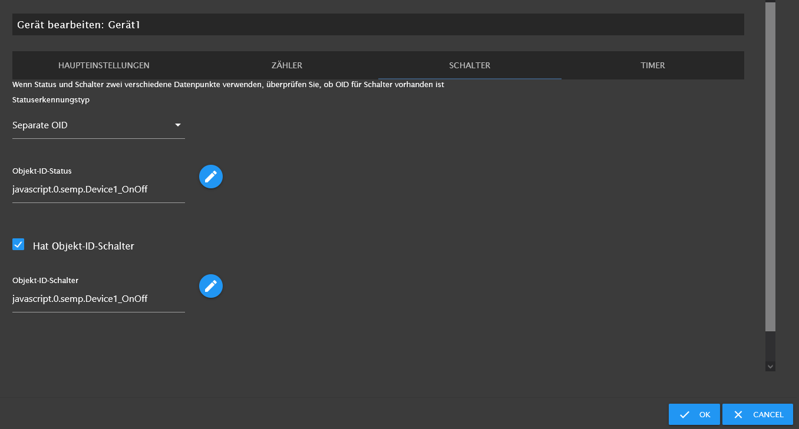
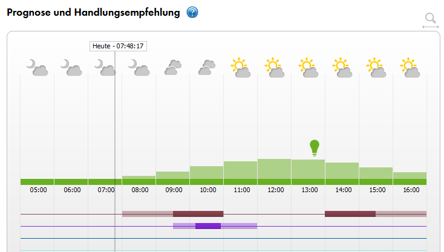

# Documentation for iobroker.semp

## Settings 

### Main

* IP Address

* UUID

* SEM-Port

* SEMP-name

* SEMP-Vendor

* extended log

### Devices

* Base-ID of devices

### Device Main

#### Device Counter

#### Device Switch

#### Device Energy Requests

## use cases

### cancel request if device does not turn on

Sometimes a device does not need the requested energy (e.g. a heat pump). In this case, it might make sense to cancel the energy request at the SHM. The SHM can thus make the available energy available to other devices.

### multi energy requests

* energy request periods must not overlap (better to have minimum five minutes time difference)
* number of energy request periods are not limited

