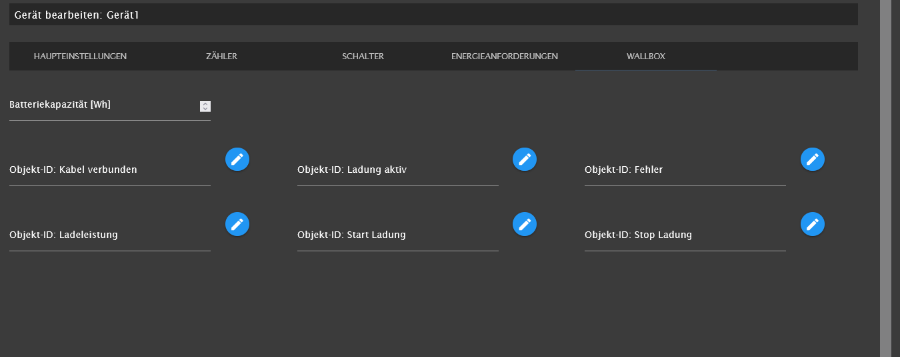

# Documentation for iobroker.semp

## Settings 

### Main

* IP Address

* UUID

* SEM-Port

* SEMP-name

* SEMP-Vendor

* extended log

### Devices

* Base-ID of devices

### Device Main

#### Device Counter

#### Device Switch

#### Device Energy Requests

Timer Active: activates the energy requests from SunnyHomeManager

cancel request if device does not switch on: option. If you like to cancel an energy request when your device does not need energy for the timeframe.
Normaly SunnyHomeManager gives an recommendation to switch on. If device does not switch on SunnyHomeManager keep trying to switch on the whole time frame.
With that option the energy request can be canceled.

#### Device Wallbox

Battery Capacity [Wh]: is used for energy requests. If battery is empty the complete capacity is requested for charge sequence.

object-ID Plug Connected: is the data point where your wallbox shows that your car is connected to wallbox. Must be true (boolean) if connected. adapter reads that datapoint only. 
if plug is connected adapter requests energy from SunnyHomeManager. If plug is disconnected energy request is canceled immedeately.

object-ID Is Charging: is the data point where your wallbox show that your car is beeing charged. Must be true (boolean) if charging. adapter reads that datapoint only.

object-ID Is Error: is the data point where your wallbox show that it is in error state. Must be true (boolean) if in error. adapter reads that datapoint only.

object-ID Charge Power: is the data point where your wallbox gets the charge power. Must be a number. Value must be in Watts [W]. adapter writes the power based on recommendaton from SunnyHomeManager.

object-ID Start Charge: is the data point where your wallbox gets started to charge. Must be a boolean. adapter sets the value to true if charge recommendation is available from SunnyHomeManager.

object-ID Stop Charge: is the data point where your wallbox gets stopped to charge. Must be a boolean. adapter sets the value to true if stop charge recommendation is available from SunnyHomeManager.

Battery Capacity [Wh], object-ID Plug Connected and object-ID Charge Power are mandatory, everything else is optionaly.

## use cases

### cancel request if device does not turn on

Sometimes a device does not need the requested energy (e.g. a heat pump). In this case, it might make sense to cancel the energy request at the SHM. The SHM can thus make the available energy available to other devices.

### multi energy requests

* energy request periods must not overlap (better to have minimum five minutes time difference)
* number of energy request periods are not limited

