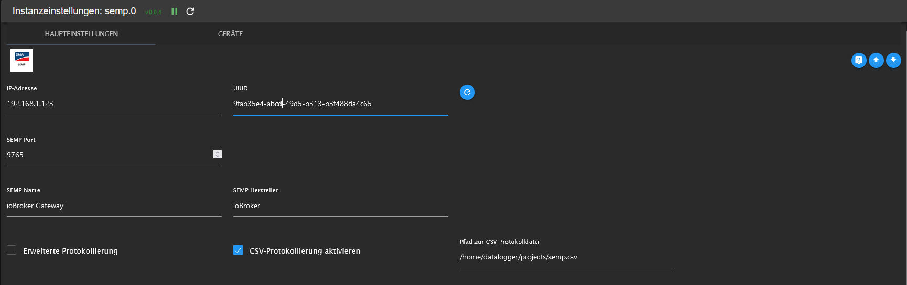
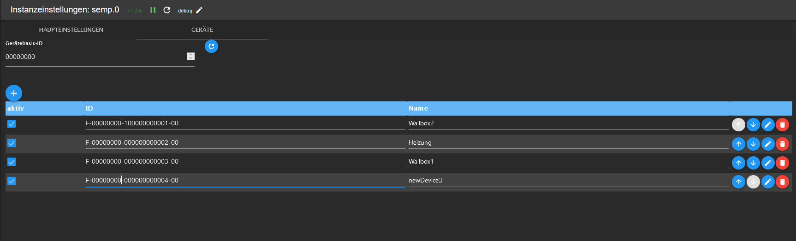
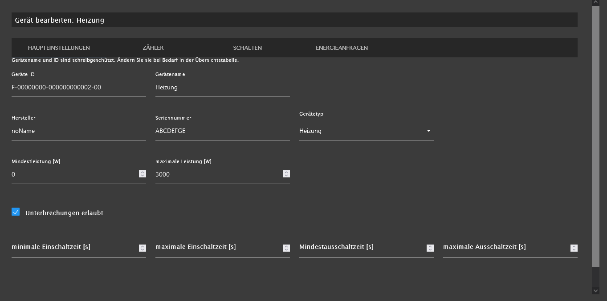
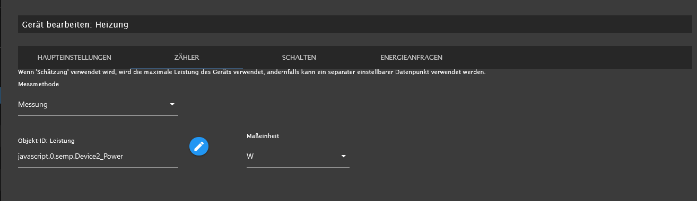
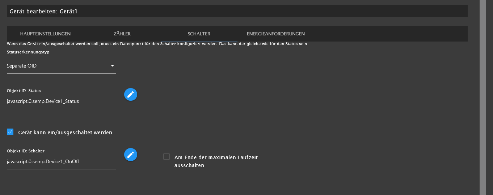
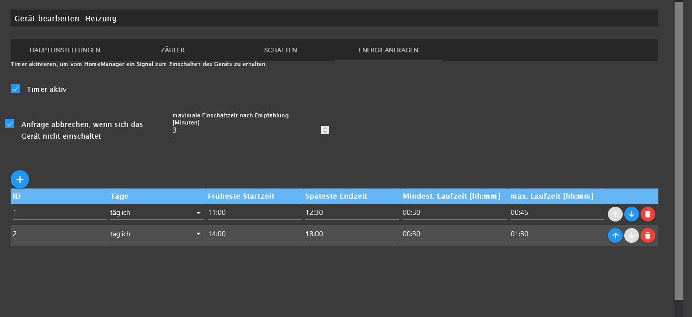
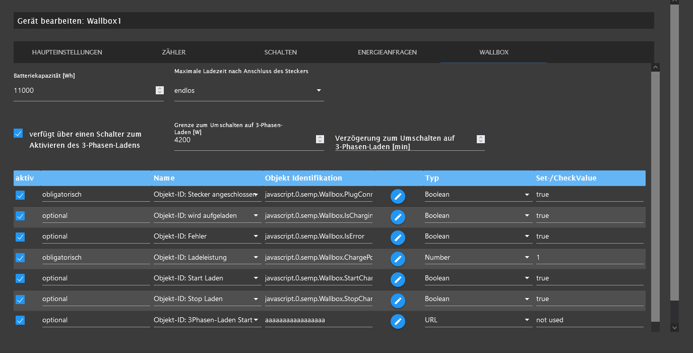

# Documentation for iobroker.semp

## Settings 

### Main

* IP-Adress
IP adress of device where ioBroker.semp is running.

* UUID
unique ID to identify SEMP gateway

* SEMP-Port
port where adapter is reachable for Homemanager. default: 9765

* SEMP-name
just a name for SEMP gateway. This name will appaer in SunnyPortal.

* SEMP-Vendor
just a name. 

* extended log
if enabled every telegram to Homemanager will be logged in ioBroker log.
**Attention** will increase the log size extremely.

### Devices

* Base-ID of devices
Base-ID of device ID's. Must be 8 characters long and must include only numbers.

You can change Device-ID's and Device-Names only here in the list. In device details those two values are read-only.

### Device Main

**Attention** maximum power must be set. 0 is not allowed.

#### Device Counter

if "Measurement" is selected an object ID for device current power must be used. Unit can be Watt [W] or Kilowatt [kW].
if "Estimation" is selected, maximum power from general settings is used.

#### Device Switch

Here we define two functions:
* Status of device (on or off)
* switch on or off of device based on energy recommendations from Homemanager

Status of device can be defined based on:
* object ID: then we need an object in ioBroker with current status
* current power: then we use object ID from device counter page. thresholds can be defined to avoid bouncing.
* always on

#### Device Energy Requests

Timer Active: activates the energy requests from SunnyHomeManager

cancel request if device does not switch on: option. If you like to cancel an energy request when your device does not need energy for the timeframe.
Normaly SunnyHomeManager gives an recommendation to switch on. If device does not switch on SunnyHomeManager keep trying to switch on the whole time frame.
With that option the energy request can be canceled.

#### Device Wallbox

Battery Capacity [Wh]: is used for energy requests. If battery is empty the complete capacity is requested for charge sequence.

maximum charge time after plug connected:  time how long energy is requested.
* 12 h: request energy to charge for the next 12 hours
* 24 h: request energy to charge for the next 24 hours
* endles: request energy to charge as long as plug is connected
* user defined: request energy to charge for a user defined period. User can define time in a datapoint 'semp.0.Devices.yourWallbox.MaxChargeTime'

has switch to enable 3phase charging: some wallboxes can be used with 1 or 3 phases. If you want to switch between 1 and 3 phases you can activate that option.

limit to switch to 3phase charging [W]: if recommended power from HomeManager is above that limit 3 phase charging will be activated

delay to switch to 3phase charging [min]: to avoid bouncing between 1 phase and 3 phase charging you can define a delay how long the power must be over limit

object-ID Plug Connected: is the data point where your wallbox shows that your car is connected to wallbox. Must be true (boolean) if connected. Adapter reads that datapoint only. 
if plug is connected adapter requests energy from SunnyHomeManager. If plug is disconnected energy request is canceled immedeately.

object-ID Is Charging: is the data point where your wallbox show that your car is beeing charged. Must be true (boolean) if charging. Adapter reads that datapoint only.

object-ID Is Error: is the data point where your wallbox show that it is in error state. Must be true (boolean) if in error. Adapter reads that datapoint only.

object-ID Charge Power: is the data point where your wallbox gets the charge power. Value must be in Watts [W]. Adapter writes the power based on recommendaton from SunnyHomeManager.

object-ID Start Charge: is the data point where your wallbox gets started to charge. Adapter sets the value to true if charge recommendation is available from SunnyHomeManager.

object-ID Stop Charge: is the data point where your wallbox gets stopped to charge. adapter sets the value to true if stop charge recommendation is available from SunnyHomeManager.

object-ID 3Phase Charge enable: is the data point to activate 3 phase charging. Is only used if 'has switch to enable 3phase charging' is enabled.

object-ID 3Phase Charge disable: is the data point to deactivate 3 phase charging. Is only used if 'has switch to enable 3phase charging' is enabled.

All object-id's can be from type:
* boolean
* number
* URL

In case of URL, Set-/CheckValue is not used.

## use cases

### cancel request if device does not turn on

Sometimes a device does not need the requested energy (e.g. a heat pump). In this case, it might make sense to cancel the energy request at the SHM. The SHM can thus make the available energy available to other devices.

### multi energy requests

* energy request periods must not overlap (better to have minimum five minutes time difference)
* number of energy request periods are not limited

